<div id="texts" style="display:inline; white-space:nowrap; float: right;"> 
        <h1>Visual Studio mit Git und GitHub</h1>
</div>

# :dart: Zielsetzung

### 1. Verständnis für die Entwicklungsumgebung
- Die Lernenden können **Visual Studio 2022** erfolgreich installieren, starten und die wichtigsten Funktionen der IDE identifizieren.

### 2. Anwendung von Versionierungssystemen
- Die Lernenden sind in der Lage, ein Projekt in Visual Studio zu erstellen und dieses mit einem Git-Repository zu verbinden.
- Sie verstehen die Bedeutung von Commits und können diese in Visual Studio durchführen.

### 3. Zusammenarbeit mit GitHub
- Die Lernenden können sich mit ihren Konten in Visual Studio anmelden.
- Sie können ein neues Repository auf GitHub erstellen, Änderungen pushen und ziehen (fetch und pull).
- Sie verstehen den Unterschied zwischen diesen Aktionen.

### 4. Arbeiten mit C#-Projekten
- Die Lernenden sind in der Lage, ein neues C#-Konsolenprojekt in Visual Studio zu erstellen.
- Sie können bestehende Projekte bearbeiten und verschiedene Projekte innerhalb einer Lösung verwalten.


# Einleitung

Die Integration von Visual Studio mit GitHub hat die Entwicklung und Zusammenarbeit von Software erheblich vereinfacht. In diesem Tutorial werden Sie durch den Prozess der Erstellung eines Projekts in Visual Studio 2022 geführt, seiner Verbindung mit einem GitHub-Repository und der Durchführung der grundlegenden Git-Operationen, die im Softwareentwicklungszyklus häufig verwendet werden. Nachdem Sie diesen Leitfaden befolgt haben, werden Sie über das notwendige Wissen verfügen, um Ihren Code effizient zu verwalten, Änderungen zu verfolgen und mit anderen Entwicklern zusammenzuarbeiten.


# Was ist ein GitHub Codespace?

Ein Codespace ist eine in der Cloud gehostete Entwicklungsumgebung. Du kannst dein Projekt für GitHub Codespaces anpassen, indem du Konfigurationsdateien in deinem Repository committest (was häufig als Configuration-as-Code bezeichnet wird). Dadurch wird eine wiederholbare Codespacekonfiguration für alle Benutzer deines Projekts erstellt.

Jeder von dir erstellte Codespace wird von GitHub in einem Docker-Container gehostet, der auf einem virtuellen Computer ausgeführt wird. Du kannst aus verschiedenen VM-Typen wählen: von 2 Kernen, 8 GB RAM und 32 GB Speicher bis hin zu 32 Kernen, 64 GB RAM und 128 GB Speicher.

Standardmäßig werden Codespaces aus einem Ubuntu Linux-Image erstellt, das eine Auswahl gängiger Sprachen und Tools enthält. Du kannst jedoch ein Image für eine Linux-Distribution deiner Wahl verwenden und es für die speziellen Anforderungen konfigurieren. Unabhängig von deinem lokalen Betriebssystem wird dein Codespace in einer Linux-Umgebung ausgeführt. Windows und macOS werden für den Remotecontainer nicht unterstützt.

Du kannst über deinen Browser, über Visual Studio Code, über die JetBrains Gateway-Anwendung oder über GitHub CLI eine Verbindung mit deinen Codespaces herstellen. Wenn du eine Verbindung herstellst, gelangst du direkt in den Docker-Container. Du hast keinen Zugriff auf den Host der übergeordneten Linux-VM.

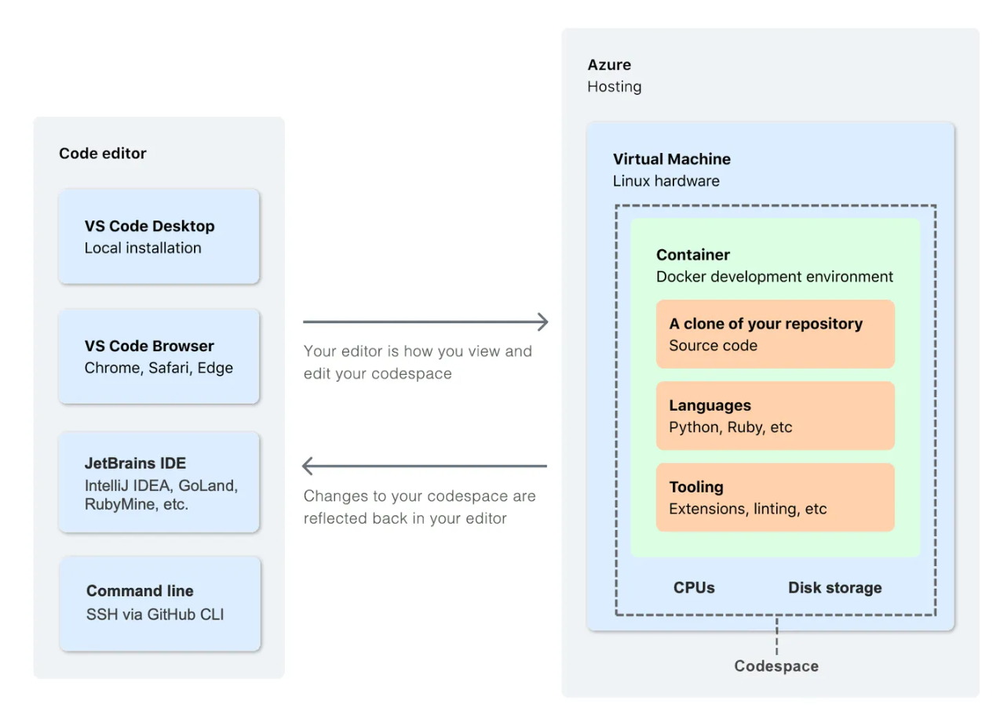


# Was ist Visual Studio Code?

Visual Studio Code (VS Code) ist ein kostenloser, plattformübergreifender Quelltext-Editor von Microsoft, verfügbar für Windows, macOS und Linux. Er basiert auf Electron und bietet Funktionen wie Syntaxhervorhebung und Debugging. Im Gegensatz zu Visual Studio fokussiert sich VS Code mehr auf Quelltext- und Textdateien statt Projektdateien und nutzt dafür Workspaces, die den Bearbeitungszustand und die Reihenfolge der geöffneten Dateien speichern. Trotz einiger Ähnlichkeiten im Namen und Funktionen wie IntelliSense hat VS Code wenig mit Visual Studio gemeinsam.

---

# Tutorial


## Codespace erstellen

Um den Codespace zu öffne, gehen Sie sicher, dass der `.devconatiner` in ihrem Repository vorhanden ist.
Clicken Sie in dem Repository das bearbeiten möchten auf **'Code'**. in der Registerkarte Codespaces klicken Sie auf **'Create codespace on main'**.

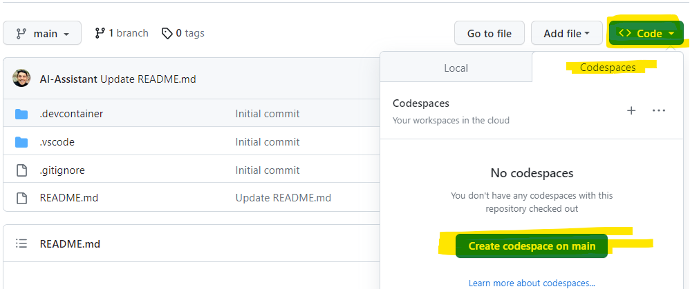

Wie Sie nun sehen können, wird der Container für ihren Codespace erstellt.

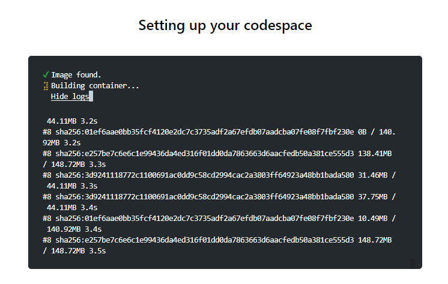


## Visual Studio Code einstellen

Damit die Einstellungen und der Code bei VS Code gespeichert sind müssen einige einstellungen vorgenommen werden. 

**Visual Studio Einstellungen Speichern und synchronisieren**
- Klicken Sie auf das Profil Icon unten links
- Klicken Sie auf `Turn on Settings Sync...`
- Klicken Sie auf `Sign in & Turn on`
- Nun wählen Sie ihr GitHub Profil

**Code und Änderungen in der Cloud speichern**
- Klicken Sie auf das Profil Icon unten links
- Klicken Sie auf `Turn on Cloud Changes...`
- Klicken Sie auf `Sign in & Turn on`
- Nun wählen Sie ihr GitHub Profil

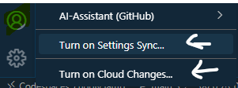
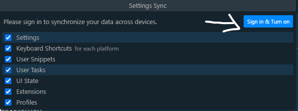


## Visual Studio Code Erweiterungen installieren

**Was sind Erweiterungen?**

Erweiterungen in Visual Studio Code ergänzen den Basis-Editor um zusätzliche Funktionen. Mit VS Code-Erweiterungen können Benutzer Sprachen, Debugger und Tools hinzufügen, um ihren Entwicklungsworkflow zu unterstützen. Dank des umfangreichen Erweiterungsmodells von VS Code können Entwickler von Erweiterungen direkt in die VS Code-Benutzeroberfläche eingreifen und Funktionen über die gleichen APIs bereitstellen, die auch von VS Code verwendet werden. Diese Erweiterungen können aus dem Visual Studio Code Marketplace gefunden, installiert und verwaltet werden.

Um erweiterungen zu installieren, klicken sie das entsprechende Symbol an und suchen Sie anschließend nach den entsprechenden Erweiterungen.


**Folgende Erweiterungen sollten Sie installieren.**

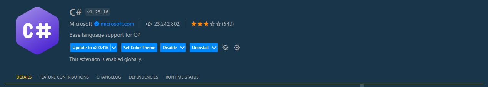
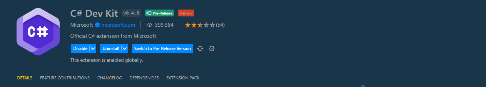
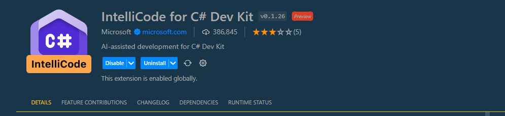


**OmniSharp aktivieren**

OmniSharp ist eine Sammlung von Werkzeugen, Editor-Integrationen und Bibliotheken, die zusammen ein Ökosystem bilden, welches unabhängig vom gewählten Editor und Betriebssystem eine hervorragende Programmiererfahrung ermöglicht.

Auch wenn Sie die notwendigen Erweiterungen installiert haben, müssen Sie noch eine Dotnet einstellung vornehmen damit KLassen und Methoden von C# in VScode angezeigt werden. 

Folgende Schritte müssen Sie vornehmen:
Öffnen Sie die VS code einstellungern mit der Tastenkombination `Strg und , `
1. Geben Sie in die Suchzeile **dotnet** ein.
2. Wählen Sie die Einstellungen von OmniSharp
3. Setzen sie den Haken bei **Use OmniSharp** 
4. Starten Sie den **Language Server** neu

Machen Sie einen **'hard refresh'** indem sie die Seite neu laden.

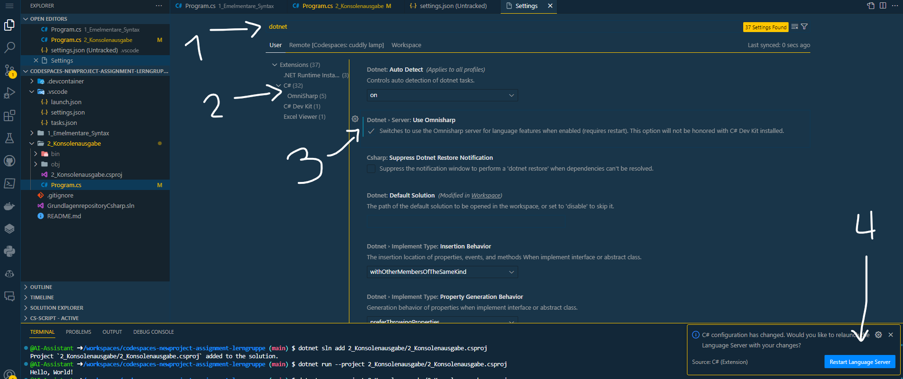

Falls das Terminal nicht geöffnet ist, können Sie es über das Burgermenü erneut öffnen.

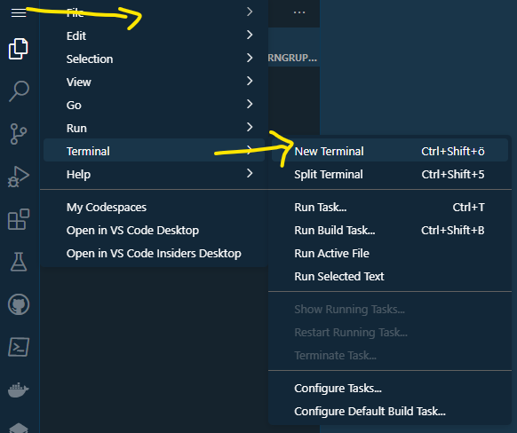

## Neue Projektmappe und Projekt erstellen

### Eine neue Projektmappe   

In Visual Studio bezeichnet eine Projektmappe eine Organisationsstruktur, die als Container dient, um Projekte zu organisieren und zu verwalten. Während Projekte die tatsächlichen Code-Dateien, Ressourcen und Konfigurationen enthalten, dient die Projektmappe als übergeordneter Rahmen, der mehrere Projekte zusammenfassen kann. Wenn man eine Projektmappe in Visual Studio öffnet, werden automatisch alle darin enthaltenen Projekte geladen. Um den Organisationsprozess zu beginnen, sollte man zuerst eine leere Projektmappe erstellen, in die dann entsprechende Projekte hinzugefügt werden können.

Um eine Projektmappe zu erstellen, geben Sie folgen den Befehl im Terminal ein:

```
dotnet new sln --name GrundlagenrepositoryCsharp
```

Bedeutung der Befehlskomponenten:

**dotnet**:    
**new**:    
**sln**:   
**--name**:   

Dieser befehl erzeug eine Neue Projektmappe in Ihrem Arbeitsverzeichnis.


### Ein neues Projekt

In .NET bezeichnet ein **"Projekt"** eine Sammlung von Dateien und Konfigurationseinstellungen, die zusammenarbeiten, um eine bestimmte Anwendungsart, z.B. eine Konsolenanwendung, eine Webanwendung oder eine Bibliothek, zu erstellen. Ein .NET-Projekt enthält in der Regel Quellcodedateien (wie C#-Dateien), Ressourcendateien und eine Projektdatei (typischerweise mit der Endung **'.csproj'** für C#-Projekte), die Metadaten über das Projekt sowie Anweisungen für das Kompilieren und Bauen der Anwendung enthält. Ein Projekt kann eigenständig sein oder Teil einer größeren Lösung (Solution) mit mehreren Projekten sein, die gemeinsam oder separat gebaut und ausgeführt werden können.

Um ein neues Projekt zu erstellen wird folgender Befehl im Terminal ausgeführt:

```
dotnet new console --language C# --name 1_Elementare_Syntax --framework net6.0
```

Bedeutung der Befehlskomponenten:
**console**:   
**--language**:   
**--framework**:   

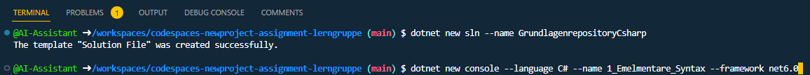

### Projekt zur Projektmappe hinzufügen

Um das Projekt der vorhandenen Projektmappe hinzuzufügen, der folgende Befehl im Terminal eingegeben werden:

```
dotnet sln add 1_Elementare_Syntax/1_Elementare_Syntax.csproj
```


Folgender Befehl Zeigt die Projekte an, die in der Projektmappe enthalten sind:
```
dotnet sln GrundlagenrepositoryCsharp.sln list
```

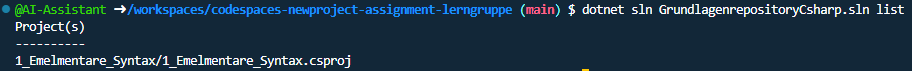

### Projekt ausführen und Debuggen   

Die Ausführung eines Programms und der Einsatz eines Debuggers sind zwei unterschiedliche Konzepte in der Softwareentwicklung:

**Ausführung eines Programms:** Wenn ein Programm ausgeführt wird, wird es ohne Unterbrechung vom Anfang bis zum Ende (oder bis zu einem unbehandelten Fehler) durchlaufen. Der Hauptzweck ist es, die gewünschten Ergebnisse oder Aktionen zu sehen, die das Programm durchführt. Bei der normalen Ausführung können Sie die Funktionalität des Programms beobachten, aber Sie haben keinen detaillierten Einblick in die internen Abläufe oder Zustände während der Ausführung.   

Um das Projekt **'1_Elementare_Syntax'** mit dem Progammcode ind der Datei **'Program.cs'** auszuführen, können Sie folgenden Code ausführen: 

```
dotnet run --project 1_Elementare_Syntax/1_Elementare_Syntax.csproj
```
Bedeutung der Befehlskomponenten:   
**run**:   
**--project**:   


Fügen Sie COdezeilen hinzu und führen Sie das Programm erneut aus:

- Gehen Sie im Arbeitsverzeichnis in das Projekt **'1_Elementare_Syntax'** und anschließend in die Datei **'Program.cs'**.
- Fügen sie unter die bestehende Zeile den Code `Console.WriteLine("Hallo, Welt!");` ein.
- Starten Sie das Programm erneut.

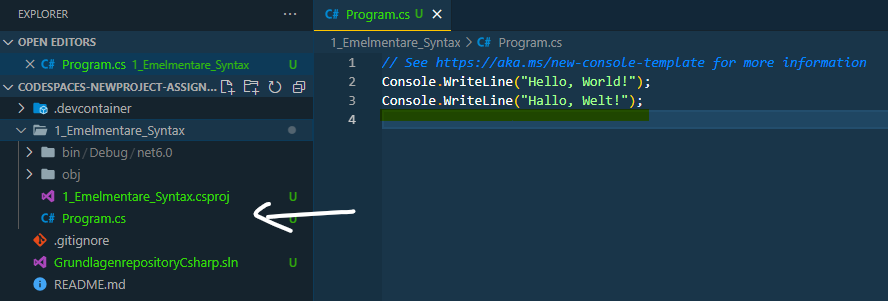
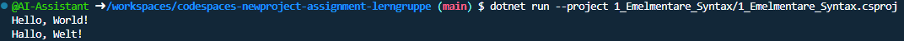

**Debugger:** Ein Debugger ist ein spezialisiertes Tool, das Entwicklern ermöglicht, ein Programm in einer kontrollierten Umgebung auszuführen, um Fehler zu finden und zu beheben. Mit einem Debugger können Entwickler das Programm schrittweise ausführen, Haltepunkte setzen, um die Ausführung an bestimmten Punkten zu stoppen, und den aktuellen Zustand des Programms (wie Variablenwerte) überwachen. Dies gibt einen detaillierten Einblick in das Verhalten des Programms und ermöglicht es, Probleme oder unerwartetes Verhalten zu identifizieren und zu korrigieren.

Um den Debugger zu testen, führen Sie folgende Schritte aus: 

1. Setzen Sie bei der neuen Zeile einen Haltepunkt indem Sie links neben die Zeilennummer klicken.
2. Starten Sie den Debugger indem Sie **F5** drücken. ❗❗ (Nun müsste sich ein Json-Datei öffnen ist das der fall, führen Sie die folgende Einstellung aus)
3. Gehen Sie ins Terminal und schauen Sie sich an was ausgeführt worden ist.
4. Mit dem **'PLay-Button'** können sie den Debuger weiter laufen lassen.

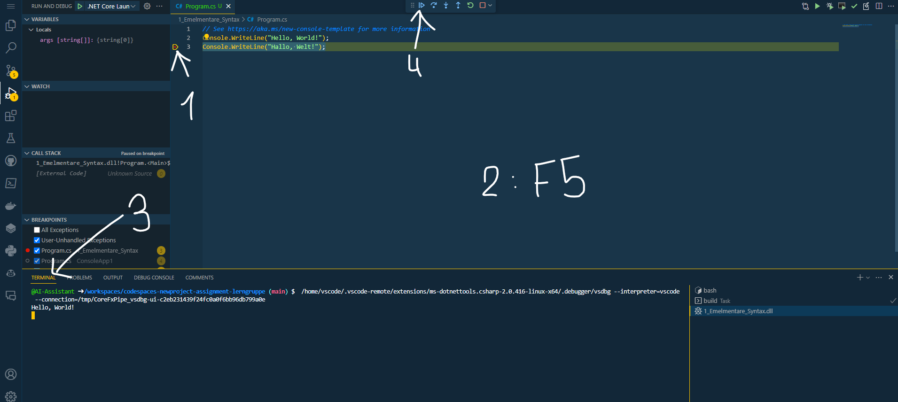

**Debugger einstellen**

Hat sich ein Json-Datei geöffnet ist das etwas gutes 🙂. Ändern Sie den Punkt **"console"** zu dem Wert `"integratedTerminal"` und speichern Sie die Datei ab. Sich können nun die Datei mit einem Klick auf das x schließen.

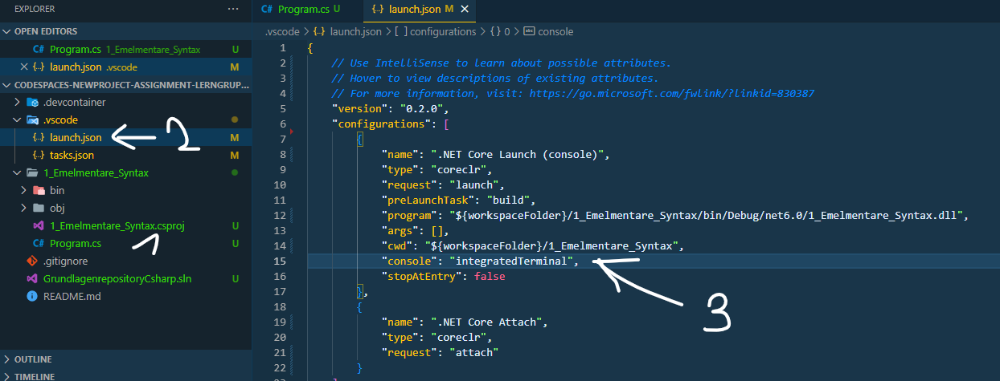

### Zweite Projektmappe hinzufügen

Erstellen Sie eine zweite Projektmappe mit dem Namen `2_Konsolenausgabe`. 
Fügen Sie dieses Projekt auch der Projektmappe hinzu.

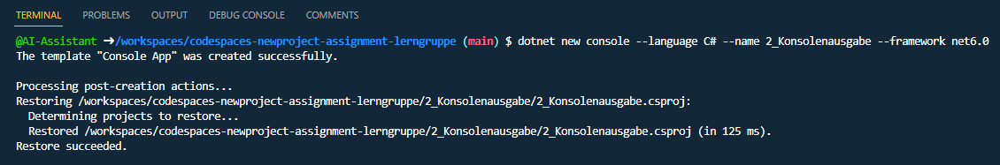


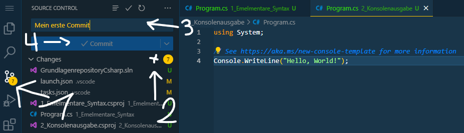
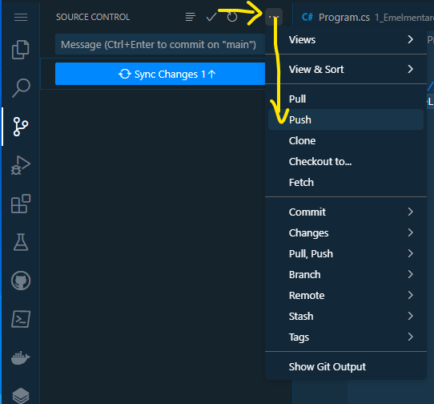
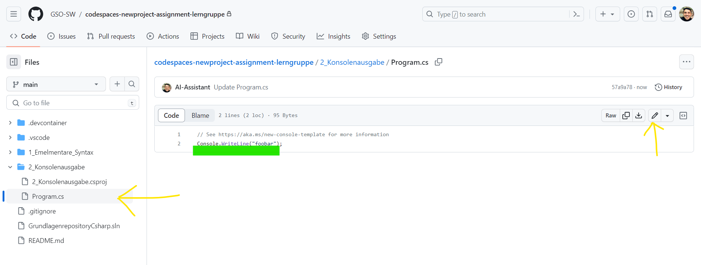
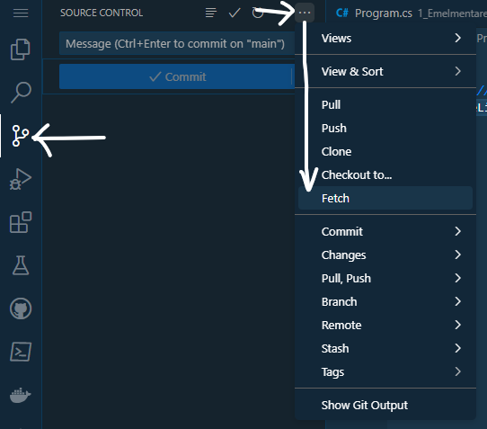


